# Frontend Refactoring & Architecture Report (Phase 1 & Phase 2)

**Repository:** Omni Multi-Modal RAG Platform  
**Target Root:** `frontend/src/`  
**Date:** September 13, 2026  
**Status:** Audit & Proposal Complete (Awaiting User Review — Zero Source Code Touched)

---

## Executive Summary & Metrics

A comprehensive static analysis and architectural audit was performed on the `frontend/src/` codebase. The frontend is built on **React 19.2**, **Vite 8.2**, **TypeScript 7.0**, **Tailwind CSS 3.4**, and **Supabase JS 2.116**.

### Key Quantative Highlights
- **Total Source Files:** 48 files
- **Total Line Count:** 14,925 lines (TypeScript + CSS)
- **Dead Code Discovered:** `frontend/src/App.css` (**2,074 lines**, 13.9% of total frontend codebase) is completely unreferenced by any HTML, TSX, or CSS import. It was left over after Tailwind CSS migration.
- **Hotspot Files (>250–300 lines):** 18 files (accounting for **12,476 lines**, or **83.6%** of the codebase).
- **Circular Imports:** **0** (Dependency graph is a strict DAG rooted at `main.tsx`).
- **Streaming Parsers:** **3 separate implementations** of SSE/NDJSON stream parsers (`App.tsx:538`, `api.ts:373`, `api.ts:420`), with protocol fragmentation (`text/event-stream` vs `application/x-ndjson`).
- **Auth Session Duplication:** Supabase auth state subscriptions (`getSession` + `onAuthStateChange`) are independently reimplemented in **4 separate components** (`App.tsx`, `Sidebar.tsx`, `AuthControls.tsx`, `SettingsModal.tsx`) without a shared context.
- **Scattered LocalStorage Keys:** **18 uncoordinated string keys** accessed directly without type definitions or centralized storage management.
- **Tenant Isolation Risk on Logout:** LocalStorage caches (`omni_sessions_cache`, `omni_msgs_*`, `omni_documents_cache`) are **not cleared** on Supabase signout, allowing session and document metadata to leak to subsequent users on shared machines.

---

## 1. Complete File Inventory

| File Path | Lines | Category | Primary Responsibility |
| :--- | :---: | :--- | :--- |
| `frontend/src/App.css` | 2,074 | Styles | **Dead Code:** Unreferenced legacy stylesheet containing redundant Claude-style CSS classes. |
| `frontend/src/components/graph/KnowledgeGraphView.tsx` | 1,112 | Component | Interactive 2D canvas force-directed graph: physics engine, drag/pan/zoom math, data fetching, filters, drawers. |
| `frontend/src/components/modals/SettingsModal.tsx` | 1,104 | Modal | Multi-tab system settings: user profile, auth status, pipeline health polling, theme selector, orb selector, RAG hyperparameter sliders. |
| `frontend/src/index.css` | 1,041 | Styles | Core stylesheet: Google Fonts imports, Tailwind directives, 12 complete theme token palettes, scrollbar styles. |
| `frontend/src/App.tsx` | 847 | Root / Layout | Application coordinator: holds global chat, session, and project state; handles Supabase auth lifecycle; executes raw streaming fetch. |
| `frontend/src/components/chat/ChatInput.tsx` | 762 | Component | Chat prompt input box: textarea auto-expand, model selector popover, effort picker, attachment carousel with scroll physics, 8-action Plus menu. |
| `frontend/src/components/vault/GitHubConnectorModal.tsx` | 579 | Modal | 4-step GitHub repo ingestion wizard: URL input, repo tree preview, NDJSON streaming ingestion progress, completion summary. |
| `frontend/src/components/chat/MessageItem.tsx` | 535 | Component | Chat bubble: Markdown rendering with GFM, citation regex parsing (`parseSingleCitation`), document inspection triggers, speech synthesis. |
| `frontend/src/components/common/OrbitingOrbLoader.tsx` | 529 | UI Primitive | Canvas-based animated orb loader implementing 8 particle physics styles (`vortex`, `bands`, `geodesic`, `pulse`, etc.) with retina DPI scaling. |
| `frontend/src/components/vault/VaultUploadModal.tsx` | 508 | Modal | Document upload modal: drag-and-drop zone, file queue state machine, retry handlers, per-file NDJSON progress bars, chunking options. |
| `frontend/src/services/api.ts` | 448 | API Layer | Centralized API client: `apiFetch` wrapper with auth/guest headers, REST endpoints, NDJSON stream readers, download URL generators. |
| `frontend/src/hooks/useDocuments.ts` | 446 | Hook | Document vault state: documents/stats fetching, localStorage caching, optimistic updates, batch deletion, batch reindexing. |
| `frontend/src/components/projects/ProjectsView.tsx` | 408 | Page / View | Projects dashboard: workspace cards, search/filter, project creation/deletion modal, local document association. |
| `frontend/src/components/layout/Sidebar.tsx` | 389 | Layout | Left navigation sidebar: session list with hover actions, active project indicator, quick links, mobile drawer backdrop, profile menu. |
| `frontend/src/components/modals/SearchModal.tsx` | 369 | Modal | Global command palette: instant fuzzy search across active chat sessions and vault documents, keyboard navigation. |
| `frontend/src/components/auth/AuthPage.tsx` | 332 | Auth | Fullscreen authentication screen: Supabase email/password login, signup, magic link OTP, OAuth buttons, animated branding. |
| `frontend/src/components/vault/KnowledgeVault.tsx` | 329 | Page / View | Vault dashboard container: orchestrates toolbar, drag-and-drop overlay, document table, bottom ribbon, pagination, modal triggers. |
| `frontend/src/components/layout/SidecarReader.tsx` | 270 | Layout | Right slide-out document reader: text preview, PDF visual page renderer toggle, metadata inspect, direct download. |
| `frontend/src/components/vault/VaultDocList.tsx` | 268 | Component | Document data table: sortable headers, multi-select checkboxes, format badges, vector indexing status, row action menu. |
| `frontend/src/components/graph/CommunityInsightsModal.tsx` | 227 | Modal | Graph community inspector: lists Leiden/Louvain community summaries, key entities, and synthesis findings. |
| `frontend/src/types/theme.ts` | 209 | Types | Theme & orb definitions: `ThemeConfig`, `OrbConfig`, 12 predefined `THEME_PRESETS`, 8 `ORB_PRESETS`. |
| `frontend/src/components/vault/VaultBottomRibbon.tsx` | 198 | Component | Vault footer bar: selected file count, pagination controls, items-per-page selector, total stats summary. |
| `frontend/src/components/graph/EntityDetailDrawer.tsx` | 184 | Component | Graph node inspector drawer: entity type badge, degree/pagerank stats, description, connected relationships list, source document links. |
| `frontend/src/components/chat/ChatCanvas.tsx` | 173 | Component | Main chat stream container: message list auto-scroll, empty hero banner with suggestions, floating scroll-to-bottom button. |
| `frontend/src/components/layout/TopHeader.tsx` | 147 | Layout | Top navigation header: active session title, model pill, sidebar toggle, project switcher, settings gear, search trigger. |
| `frontend/src/components/pdf/VisualPdfReader.tsx` | 140 | Component | PDF page image viewer: fetches rendered page PNGs via `/api/pdf-page-image`, zoom controls, page stepper. |
| `frontend/src/components/graph/RelationshipDetailDrawer.tsx` | 128 | Component | Graph edge inspector drawer: relation type, edge weight, source doc provenance snippet, inspect doc button. |
| `frontend/src/components/common/DocumentSquareTile.tsx` | 118 | UI Primitive | Compact document chip used in attachment carousels and cited sources list with file extension color coding. |
| `frontend/src/components/vault/VaultToolbar.tsx` | 91 | Component | Vault actions bar: search input, format filter tabs (All/PDF/MD/TXT), upload button, GitHub connector trigger. |
| `frontend/src/context/ThemeContext.tsx` | 85 | Context | Global theme provider: active theme, orb style, chat font, localStorage sync, DOM `data-theme` attribute updates. |
| `frontend/src/components/vault/VaultMassActionsBar.tsx` | 83 | Component | Floating bulk actions bar: selected items counter, select all across pages, bulk reindex button, bulk delete button. |
| `frontend/src/components/chat/GraphProvenanceCard.tsx` | 82 | Component | Provenance card rendered under messages showing multi-hop graph paths and entity relationships used during RAG generation. |
| `frontend/src/components/modals/ShareModal.tsx` | 77 | Modal | Chat export dialog: copy full markdown conversation, export raw text, shareable link placeholder. |
| `frontend/src/components/modals/ProjectsModal.tsx` | 74 | Modal | **Redundant Modal:** Static stub dialog showing single default project; overshadowed by `ProjectsView.tsx`. |
| `frontend/src/components/vault/VaultKpiGrid.tsx` | 70 | Component | Vault KPI cards: total indexed documents, vector chunks, storage health, pipeline engine status. |
| `frontend/src/hooks/useSpeech.ts` | 65 | Hook | Web Speech API wrapper: speech-to-text recognition with browser support detection and auto-stop callbacks. |
| `frontend/src/components/vault/VaultDropzone.tsx` | 60 | Component | Full-width drag-and-drop target for file uploads with dashed animated border and icon. |
| `frontend/src/types/graph.ts` | 59 | Types | Graph data types: `GraphNode`, `GraphLink`, `GraphCommunity`, `KnowledgeGraphData`, `GraphHopTrace`. |
| `frontend/src/components/common/CustomCheckbox.tsx` | 55 | UI Primitive | Accessible SVG checkbox supporting checked, unchecked, and indeterminate states with smooth micro-animations. |
| `frontend/src/components/common/FormatBadge.tsx` | 49 | UI Primitive | Small color-coded file extension badge (`PDF`, `MD`, `TXT`, etc.) referencing theme variables. |
| `frontend/src/components/layout/AuthControls.tsx` | 48 | Layout | Header auth widget: displays signed-in user email with signout button, or login button when unauthenticated. |
| `frontend/src/types/project.ts` | 42 | Types | Project workspace types: `ProjectItem` interface and `INITIAL_PROJECTS` mock catalog. |
| `frontend/src/types/chat.ts` | 35 | Types | Chat session & message types: `ChatMessage`, `ChatSession`, `ContextChunk`, `ModelOption`. |
| `frontend/src/types/document.ts` | 23 | Types | Document metadata types: `DocumentItem`, `CollectionStats`, `UploadResponse`. |
| `frontend/src/components/common/Toast.tsx` | 17 | UI Primitive | Minimal floating toast notification container displayed at bottom right. |
| `frontend/src/main.tsx` | 13 | Root | React application entrypoint: mounts `ThemeProvider` and `App` into `#root`. |
| `frontend/src/vite-env.d.ts` | 12 | Types | Vite client type definitions. |
| `frontend/src/lib/supabase.ts` | 11 | Service | Supabase client initializer with fallback credentials and configuration flag. |

---

## 2. Dependency Graph & Coupling Analysis

```mermaid
graph TD
    main["main.tsx"] --> ThemeContext["context/ThemeContext.tsx"]
    main --> App["App.tsx"]
    
    App --> Sidebar["components/layout/Sidebar.tsx"]
    App --> TopHeader["components/layout/TopHeader.tsx"]
    App --> SidecarReader["components/layout/SidecarReader.tsx"]
    App --> ChatCanvas["components/chat/ChatCanvas.tsx"]
    App --> KnowledgeVault["components/vault/KnowledgeVault.tsx"]
    App --> KnowledgeGraphView["components/graph/KnowledgeGraphView.tsx"]
    App --> ProjectsView["components/projects/ProjectsView.tsx"]
    App --> AuthPage["components/auth/AuthPage.tsx"]
    App --> SettingsModal["components/modals/SettingsModal.tsx"]
    App --> SearchModal["components/modals/SearchModal.tsx"]
    App --> ShareModal["components/modals/ShareModal.tsx"]
    App --> ProjectsModal["components/modals/ProjectsModal.tsx"]
    App --> Toast["components/common/Toast.tsx"]
    
    App --> useDocuments["hooks/useDocuments.ts"]
    App --> useSpeech["hooks/useSpeech.ts"]
    App --> api["services/api.ts"]
    App --> supabase["lib/supabase.ts"]

    ChatCanvas --> MessageItem["components/chat/MessageItem.tsx"]
    ChatCanvas --> ChatInput["components/chat/ChatInput.tsx"]
    MessageItem --> OrbitingOrbLoader["components/common/OrbitingOrbLoader.tsx"]
    MessageItem --> FormatBadge["components/common/FormatBadge.tsx"]
    MessageItem --> DocumentSquareTile["components/common/DocumentSquareTile.tsx"]
    MessageItem --> GraphProvenanceCard["components/chat/GraphProvenanceCard.tsx"]

    KnowledgeVault --> VaultToolbar["components/vault/VaultToolbar.tsx"]
    KnowledgeVault --> VaultKpiGrid["components/vault/VaultKpiGrid.tsx"]
    KnowledgeVault --> VaultDropzone["components/vault/VaultDropzone.tsx"]
    KnowledgeVault --> VaultDocList["components/vault/VaultDocList.tsx"]
    KnowledgeVault --> VaultMassActionsBar["components/vault/VaultMassActionsBar.tsx"]
    KnowledgeVault --> VaultBottomRibbon["components/vault/VaultBottomRibbon.tsx"]
    KnowledgeVault --> VaultUploadModal["components/vault/VaultUploadModal.tsx"]
    KnowledgeVault --> GitHubConnectorModal["components/vault/GitHubConnectorModal.tsx"]

    KnowledgeGraphView --> EntityDetailDrawer["components/graph/EntityDetailDrawer.tsx"]
    KnowledgeGraphView --> RelationshipDetailDrawer["components/graph/RelationshipDetailDrawer.tsx"]
    KnowledgeGraphView --> CommunityInsightsModal["components/graph/CommunityInsightsModal.tsx"]
    KnowledgeGraphView --> OrbitingOrbLoader
    KnowledgeGraphView --> api

    TopHeader --> AuthControls["components/layout/AuthControls.tsx"]
    AuthControls --> supabase
    Sidebar --> supabase
    SettingsModal --> supabase
```



### Dependency Findings
1. **Zero Circular Imports:** Topological sort confirms zero dependency cycles.
2. **Extreme Prop Drilling:**
   - `showToast(msg)` is instantiated in `App.tsx` and prop-drilled down through **9 separate component branches** and even passed as a parameter into `useDocuments(showToast)`.
   - Modals and inspection drawers require passing 8–12 handlers down through `App -> ChatCanvas -> MessageItem` and `App -> KnowledgeVault -> VaultDocList`.
3. **Data Fetching + Heavy UI Mixed (Smell):**
   - [KnowledgeGraphView.tsx](file:///Users/anurag/Downloads/RAG/frontend/src/components/graph/KnowledgeGraphView.tsx): Contains both canvas physics simulations (Euler/Verlet vector math) AND raw API calls (`api.getGraph()`, `api.buildKnowledgeGraph()`, `api.getCommunities()`).
   - [SettingsModal.tsx](file:///Users/anurag/Downloads/RAG/frontend/src/components/modals/SettingsModal.tsx): Fetches health diagnostics (`api.getHealth()`), Supabase auth session, and collection resets directly while rendering 6 extensive tab views.
   - [GitHubConnectorModal.tsx](file:///Users/anurag/Downloads/RAG/frontend/src/components/vault/GitHubConnectorModal.tsx): Directly executes preview fetch and streaming ingestion while rendering a 4-step wizard UI.
   - [VaultUploadModal.tsx](file:///Users/anurag/Downloads/RAG/frontend/src/components/vault/VaultUploadModal.tsx): Manages upload streams and retry logic while rendering drag-and-drop cards.

---

## 3. Large File Breakdown (>250–300 Lines)

| File | Lines | Root Cause Diagnosis |
| :--- | :---: | :--- |
| [App.css](file:///Users/anurag/Downloads/RAG/frontend/src/App.css) | 2,074 | **100% Dead Code.** Legacy CSS classes (`.claude-layout`, `.claude-sidebar`, `.nav-item`, etc.) completely abandoned when Tailwind CSS utility classes and `index.css` were adopted. Not imported anywhere. |
| [KnowledgeGraphView.tsx](file:///Users/anurag/Downloads/RAG/frontend/src/components/graph/KnowledgeGraphView.tsx) | 1,112 | Handles **5 distinct concerns inline**: (1) physics simulation engine (forces, velocities, bounding boxes), (2) canvas interaction handlers (pan, zoom, pinch, drag, hover hit-testing), (3) API fetching/polling, (4) palette/color hashing math, and (5) toolbar/drawer/modal UI markup. |
| [SettingsModal.tsx](file:///Users/anurag/Downloads/RAG/frontend/src/components/modals/SettingsModal.tsx) | 1,104 | Defines **6 full-screen tab views inline** (`general`, `account`, `health`, `theme`, `orb`, `rag`), plus custom select dropdowns, health polling timers, and collection reset confirmations in a single file. |
| [index.css](file:///Users/anurag/Downloads/RAG/frontend/src/index.css) | 1,041 | Defines 12 separate theme token dictionaries with 40+ CSS variables each, plus scrollbar rules and utility classes. (Legitimate, but can be split into theme token partials). |
| [App.tsx](file:///Users/anurag/Downloads/RAG/frontend/src/App.tsx) | 847 | High coupling coordinator smell. Manages session cache, project state, message history, audio/speech recording, tab routing, Supabase auth state, and a manual 100-line raw streaming reader. |
| [ChatInput.tsx](file:///Users/anurag/Downloads/RAG/frontend/src/components/chat/ChatInput.tsx) | 762 | Combines multi-action Plus popover (8 action items), attachment preview carousel with touch/wheel horizontal physics, model picker with nested effort submenus, and textarea auto-resize. |
| [GitHubConnectorModal.tsx](file:///Users/anurag/Downloads/RAG/frontend/src/components/vault/GitHubConnectorModal.tsx) | 579 | Combines multi-step wizard state machine, repo tree selection/filtering, streaming NDJSON progress reader, and local type definitions. |
| [MessageItem.tsx](file:///Users/anurag/Downloads/RAG/frontend/src/components/chat/MessageItem.tsx) | 535 | Contains 150+ lines of inline regex markdown citation parsing (`parseSingleCitation`), audio utterance speech synthesizer, markdown renderers, and collapsible citation cards. |
| [OrbitingOrbLoader.tsx](file:///Users/anurag/Downloads/RAG/frontend/src/components/common/OrbitingOrbLoader.tsx) | 529 | Implements 8 separate 3D canvas particle physics animation algorithms (`bands`, `geodesic`, `pulse`, `vortex`, etc.) with retina scaling inside a single React component. |
| [VaultUploadModal.tsx](file:///Users/anurag/Downloads/RAG/frontend/src/components/vault/VaultUploadModal.tsx) | 508 | Manages multi-file upload queue state machine, retry count logic, drag-and-drop dropzone, per-file NDJSON progress bars, and modal layout. |
| [services/api.ts](file:///Users/anurag/Downloads/RAG/frontend/src/services/api.ts) | 448 | Single monolithic API file combining auth header logic, guest ID generator, sessions, messages, documents, stats, graph endpoints, GitHub connector, and two separate streaming readers. |
| [useDocuments.ts](file:///Users/anurag/Downloads/RAG/frontend/src/hooks/useDocuments.ts) | 446 | Handles document list state, Qdrant collection stats, localStorage sync, single & batch uploads, single & batch deletions with optimistic rollbacks, and reindexing. |
| [ProjectsView.tsx](file:///Users/anurag/Downloads/RAG/frontend/src/components/projects/ProjectsView.tsx) | 408 | Combines project workspaces dashboard, search/filter, project creation modal, deletion modal, and local document count summaries. |
| [Sidebar.tsx](file:///Users/anurag/Downloads/RAG/frontend/src/components/layout/Sidebar.tsx) | 389 | Handles session lists, mobile overlay backdrop, context menu positioning, Supabase auth subscription, and profile menu popover. |
| [SearchModal.tsx](file:///Users/anurag/Downloads/RAG/frontend/src/components/modals/SearchModal.tsx) | 369 | In-memory fuzzy search across both sessions and vault documents, keyboard shortcuts (`Cmd+K`, arrows, enter), and category tab filtering. |
| [AuthPage.tsx](file:///Users/anurag/Downloads/RAG/frontend/src/components/auth/AuthPage.tsx) | 332 | Supabase login, signup, OTP magic link verification, OAuth handlers, tab switcher, and branding graphics. |
| [KnowledgeVault.tsx](file:///Users/anurag/Downloads/RAG/frontend/src/components/vault/KnowledgeVault.tsx) | 329 | Orchestrates document filtering, sorting, pagination, drag-and-drop overlay, mass actions, and sub-modal state. |
| [SidecarReader.tsx](file:///Users/anurag/Downloads/RAG/frontend/src/components/layout/SidecarReader.tsx) | 270 | Combines drawer layout, visual PDF viewer integration, text previewer, download button, and close handlers. |
| [VaultDocList.tsx](file:///Users/anurag/Downloads/RAG/frontend/src/components/vault/VaultDocList.tsx) | 268 | Table layout, sortable headers, master checkbox, per-row checkboxes, format badges, and row action popovers. |

---

## 4. Duplicated Logic & Code Smells

### A. Triplicate Stream Parsing Loops
1. [App.tsx:538–580](file:///Users/anurag/Downloads/RAG/frontend/src/App.tsx#L538-L580): Implements a manual `reader.read()` loop with `TextDecoder` for SSE chat streaming (`data: JSON\n\n`).
2. [services/api.ts:373–401](file:///Users/anurag/Downloads/RAG/frontend/src/services/api.ts#L373-L401): Implements a manual `reader.read()` loop with `TextDecoder` for document upload streaming (NDJSON format).
3. [services/api.ts:420–445](file:///Users/anurag/Downloads/RAG/frontend/src/services/api.ts#L420-L445): Implements the exact same `reader.read()` loop with `TextDecoder` for GitHub sync streaming (NDJSON format).

### B. Raw Fetch Bypassing Centralized API Client
- [App.tsx:520](file:///Users/anurag/Downloads/RAG/frontend/src/App.tsx#L520): Bypasses `apiFetch` in `services/api.ts` to call `fetch(`${API_BASE}/api/chat/stream`)`. It manually duplicates:
  - Token extraction (`await getAuthToken()`)
  - `Bearer` vs `X-Guest-Id` header assignment
  - Error response status checks

### C. Quadruplicate Supabase Auth Subscriptions
The pattern `supabase.auth.getSession()` and `supabase.auth.onAuthStateChange()` is repeated in 4 separate files:
1. [App.tsx:294–326](file:///Users/anurag/Downloads/RAG/frontend/src/App.tsx#L294-L326)
2. [Sidebar.tsx:58–68](file:///Users/anurag/Downloads/RAG/frontend/src/components/layout/Sidebar.tsx#L58-L68)
3. [AuthControls.tsx:13–24](file:///Users/anurag/Downloads/RAG/frontend/src/components/layout/AuthControls.tsx#L13-L24)
4. [SettingsModal.tsx:92–97](file:///Users/anurag/Downloads/RAG/frontend/src/components/modals/SettingsModal.tsx#L92-L97)
None of them share an `AuthContext`, meaning user state is duplicated and uncoordinated.

### D. Modal Backdrop & Dialog Shell Boilerplate
Seven different modal components manually implement identical backdrop overlay, click-outside dismissal, ESC key dismissal, and header styling:
- [SettingsModal.tsx:138](file:///Users/anurag/Downloads/RAG/frontend/src/components/modals/SettingsModal.tsx#L138)
- [SearchModal.tsx:152](file:///Users/anurag/Downloads/RAG/frontend/src/components/modals/SearchModal.tsx#L152)
- [ShareModal.tsx:37](file:///Users/anurag/Downloads/RAG/frontend/src/components/modals/ShareModal.tsx#L37)
- [ProjectsModal.tsx:19](file:///Users/anurag/Downloads/RAG/frontend/src/components/modals/ProjectsModal.tsx#L19)
- [CommunityInsightsModal.tsx:96](file:///Users/anurag/Downloads/RAG/frontend/src/components/graph/CommunityInsightsModal.tsx#L96)
- [GitHubConnectorModal.tsx:225](file:///Users/anurag/Downloads/RAG/frontend/src/components/vault/GitHubConnectorModal.tsx#L225)
- [VaultUploadModal.tsx:274](file:///Users/anurag/Downloads/RAG/frontend/src/components/vault/VaultUploadModal.tsx#L274)

### E. File Extension & Formatting Helpers Duplicated Inline
- `filename.split('.').pop()?.toLowerCase() || ''` is written inline across **6 locations**:
  - `VaultDocList.tsx:133`
  - `KnowledgeVault.tsx:83`
  - `KnowledgeVault.tsx:94`
  - `KnowledgeVault.tsx:95`
  - `FormatBadge.tsx:9`
  - `DocumentSquareTile.tsx:22`
- File size MB calculation `(file.size / (1024 * 1024)).toFixed(2)` is written inline in **5 locations** across `useDocuments.ts` and `VaultUploadModal.tsx`.

---

## 5. Scattered Configuration & Magic Strings

### A. LocalStorage Key Fragmentation (18 Keys)
Storage keys are scattered across components as hardcoded string literals:
| Key Name | Files Using Key | Purpose |
| :--- | :--- | :--- |
| `omni_active_tab` | `App.tsx:27, 38` | Active main navigation tab |
| `omni_projects` | `App.tsx:47, 422, 430` | Stored projects list |
| `omni_active_project` | `App.tsx:58, 424, 433, 730` | Currently selected project ID |
| `omni_sessions_cache` | `App.tsx:75, 86, 97, 147, 224, 377` | Cached chat sessions array |
| `omni_active_session_id` | `App.tsx:84, 96, 121, 155, 325, 357` | Active chat session ID |
| `omni_msgs_${sessionId}` | `App.tsx:65, 126, 262, 370, 600` | Cached messages per session |
| `omni_documents_cache` | `useDocuments.ts:8, 36, 52, 204, 353` | Cached vault documents array |
| `omni_stats_cache` | `useDocuments.ts:16, 42, 66, 205, 354` | Cached Qdrant collection statistics |
| `omni_web_search_enabled`| `App.tsx:166, 711` | Web search toggle state |
| `omni_custom_instructions`| `App.tsx:518`, `SettingsModal.tsx:70` | Custom system prompt text |
| `omni_user_name` | `SettingsModal.tsx:67` | User display name |
| `omni_call_name` | `SettingsModal.tsx:68` | User call name |
| `omni_work_domain` | `SettingsModal.tsx:69` | User professional domain |
| `omni_motion` | `SettingsModal.tsx:72` | Reduced motion preference |
| `omni_theme` | `ThemeContext.tsx:26, 42`, `index.html:11` | Active color theme ID |
| `omni_orb_style` | `ThemeContext.tsx:31, 50` | Active animated orb style ID |
| `omni_chat_font` | `ThemeContext.tsx:36, 56` | Active chat typography font |
| `omni_guest_session_id` | `api.ts:75, 79` (in `sessionStorage`) | Ephemeral unauthenticated guest ID |

### B. Hardcoded Model Catalog
[ChatInput.tsx:47–53](file:///Users/anurag/Downloads/RAG/frontend/src/components/chat/ChatInput.tsx#L47-L53): The `AVAILABLE_MODELS` array is hardcoded inside `ChatInput.tsx`. If new models are added to the backend (`src/config/settings.py`), the frontend requires editing a presentation component rather than a centralized config file.

### C. Hardcoded Supabase URL Fallback
[lib/supabase.ts:3](file:///Users/anurag/Downloads/RAG/frontend/src/lib/supabase.ts#L3): Hardcodes `'https://jyhqogjqtgtvlnaursey.supabase.co'` as a fallback URL. Should be centralized in a configuration module.

---

## 6. State Management & Architecture Smells

1. **God Component Coordinator (`App.tsx`):**
   `App.tsx` (847 lines) holds over 20 pieces of state. It handles:
   - Sessions list & active session ID
   - Message history & message streaming
   - Projects list & active project
   - Audio / Speech recognition state
   - Supabase auth session lifecycle
   - Document upload triggers
   - Modals visibility (Settings, Search, Share, Projects)
   - Toast notification timeout queue
2. **Prop-Drilling Toast Notifications:**
   Rather than having a simple `useToast()` hook backed by a lightweight context, `showToast` is passed down across **9 layers** of components.
3. **Projects Feature is 100% Client-Side:**
   There are no backend endpoints for `/api/projects`. All project creation, deletion, and document associations live in `localStorage`. Furthermore, [ProjectsModal.tsx](file:///Users/anurag/Downloads/RAG/frontend/src/components/modals/ProjectsModal.tsx) is a redundant, hardcoded stub dialog that conflicts with the full-featured [ProjectsView.tsx](file:///Users/anurag/Downloads/RAG/frontend/src/components/projects/ProjectsView.tsx).

---

## 7. SSE & Streaming Consumption Audit

The backend exposes two distinct streaming formats:
1. **Chat Stream (`/api/chat/stream`):**
   - Protocol: Standard SSE (`text/event-stream`)
   - Event Shape: `data: {"type": "status"|"contexts"|"token"|"done", ...}\n\n`
   - Terminal Marker: `data: [DONE]\n\n` or `{"type": "done"}`
   - **Frontend Consumption Gap:** `App.tsx:557–562` only checks `parsed.token` and `parsed.contexts`. It **completely ignores** `parsed.type === 'status'` ("Searching vault & live web via Tavily..."). As a result, users see an empty spinner instead of live status messages.
2. **File Ingestion & GitHub Sync Streams (`/api/upload-stream`, `/api/github/sync-stream`):**
   - Protocol: NDJSON (`application/x-ndjson` or newline-delimited JSON)
   - Event Shape: `{"type": "progress"|"done"|"error", stage: ..., progress: ..., message: ...}\n`
   - Terminal Marker: `{"type": "done", "success": true}`
   - **Frontend Consumption Gap:** `api.ts:373–401` and `api.ts:420–445` implement duplicate buffering loops to assemble chunks split across network packets.

---

## 8. TypeScript Safety & Schema Alignment

1. **`Promise<any>` Holes in API Client:**
   - [services/api.ts:292](file:///Users/anurag/Downloads/RAG/frontend/src/services/api.ts#L292): `getGraph(): Promise<any>`
   - [services/api.ts:310](file:///Users/anurag/Downloads/RAG/frontend/src/services/api.ts#L310): `getCommunities(): Promise<{ communities: any[]; total: number }>`
   - [services/api.ts:318](file:///Users/anurag/Downloads/RAG/frontend/src/services/api.ts#L318): `updateCommunities(): Promise<any>`
   - [services/api.ts:327](file:///Users/anurag/Downloads/RAG/frontend/src/services/api.ts#L327): `githubPreview(): Promise<any>`
   - [services/api.ts:408](file:///Users/anurag/Downloads/RAG/frontend/src/services/api.ts#L408): `githubSyncStream(): Promise<any>`
2. **Union Type Casting (`(l.source as any).id`):**
   In `types/graph.ts`, `GraphLink.source` is typed as `string | GraphNode`. In `KnowledgeGraphView.tsx` and `EntityDetailDrawer.tsx`, this leads to repeated ugly type casts: `(l.source as any).id` or `(link.target as any).id` (**over 15 occurrences**).
3. **Local Duplicate Type Definitions:**
   `GitHubFile`, `PreviewResult`, `SyncResult` are declared locally in `GitHubConnectorModal.tsx` instead of in a shared types module.

---

## 9. Security & Tenant Isolation Audit

1. **Frontend Isolation Model:**
   The frontend correctly does not transmit a client-chosen `user_id`. It relies purely on the server deriving identity from `Authorization: Bearer <JWT>` or `X-Guest-Id: <id>`.
2. **Shared Machine Cache Leakage (High Priority Security Finding):**
   When a user clicks "Sign Out" in [Sidebar.tsx:70](file:///Users/anurag/Downloads/RAG/frontend/src/components/layout/Sidebar.tsx#L70) or [AuthControls.tsx:27](file:///Users/anurag/Downloads/RAG/frontend/src/components/layout/AuthControls.tsx#L27), `supabase.auth.signOut()` is executed. In `App.tsx:321`, the `SIGNED_OUT` handler removes `omni_active_session_id`, **but leaves `omni_sessions_cache`, `omni_documents_cache`, and `omni_msgs_*` intact in `localStorage`**.
   - If a new user or guest opens the application in that same browser, `App.tsx` and `useDocuments.ts` immediately hydrate from `localStorage`, exposing the previous user's private session titles, chat transcripts, and document filenames!

---

## 10. Phase 2 — Proposed Modular Architecture

### Proposed Target Directory Structure

```
frontend/src/
├── api/                                # Modular API client (decoupling services/api.ts)
│   ├── client.ts                       # Core fetch wrapper, auth headers, guest ID handling
│   ├── chat.ts                         # Sessions, messages, and chat endpoints
│   ├── documents.ts                    # Document list, upload, delete, reindex, download URL
│   ├── graph.ts                        # Knowledge graph, communities, build triggers
│   ├── github.ts                       # GitHub repo preview and branch listings
│   ├── health.ts                       # System pipeline diagnostic checks
│   └── index.ts                        # Unified api export preserving backward compatibility
│
├── config/                             # Centralized constants and environment config
│   ├── env.ts                          # API_BASE, Supabase credentials, environment guards
│   ├── storageKeys.ts                  # Typed enum / constants for all 18 localStorage keys
│   └── models.ts                       # AVAILABLE_MODELS catalog & default model settings
│
├── context/                            # Truly global cross-tree context providers
│   ├── ThemeContext.tsx                # Active theme, orb style, chat font (existing)
│   ├── AuthContext.tsx                 # [NEW] Single source of truth for Supabase user & session
│   └── ToastContext.tsx                # [NEW] Lightweight toast dispatcher eliminating 9-level prop drill
│
├── hooks/                              # Shared custom hooks
│   ├── useChat.ts                      # [NEW] Encapsulates sessions, messages, active session state
│   ├── useChatStream.ts                # [NEW] Canonical chat SSE stream consumer
│   ├── useNDJSONStream.ts              # [NEW] Reusable NDJSON reader (upload & github sync)
│   ├── useDocuments.ts                 # Cleaned document vault hook (decoupled from showToast)
│   ├── useAuth.ts                      # Hook consuming AuthContext
│   ├── useToast.ts                     # Hook consuming ToastContext
│   └── useSpeech.ts                    # Web Speech API hook (existing)
│
├── components/
│   ├── ui/                             # Small reusable primitives
│   │   ├── CustomCheckbox.tsx          # Accessible animated checkbox
│   │   ├── FormatBadge.tsx             # Color-coded file extension badge
│   │   ├── DocumentSquareTile.tsx      # Compact document square tile
│   │   ├── OrbitingOrbLoader.tsx       # Orbiting orb canvas loader (renderer extracted to utils)
│   │   ├── Modal.tsx                   # [NEW] Canonical accessible modal shell (backdrop, ESC, focus)
│   │   ├── Toast.tsx                   # Floating toast notification
│   │   └── EmptyState.tsx              # [NEW] Reusable icon + message empty state
│   │
│   ├── layout/                         # Core application frame
│   │   ├── Sidebar.tsx                 # Left navigation sidebar
│   │   ├── TopHeader.tsx               # Top header bar
│   │   ├── AuthControls.tsx            # Header login / user menu pill
│   │   └── SidecarReader.tsx           # Document preview sidecar
│   │
│   └── features/                       # Domain-specific feature modules
│       ├── chat/                       # Chat canvas, message bubbles, inputs, provenance
│       │   ├── ChatCanvas.tsx
│       │   ├── ChatInput.tsx           # Modularized input (carousel & plus popover separated)
│       │   ├── MessageItem.tsx         # Cleaned message bubble (citation parser in utils)
│       │   └── GraphProvenanceCard.tsx
│       │
│       ├── vault/                      # Knowledge vault dashboard
│       │   ├── KnowledgeVault.tsx
│       │   ├── VaultToolbar.tsx
│       │   ├── VaultKpiGrid.tsx
│       │   ├── VaultDropzone.tsx
│       │   ├── VaultDocList.tsx
│       │   ├── VaultMassActionsBar.tsx
│       │   ├── VaultBottomRibbon.tsx
│       │   ├── VaultUploadModal.tsx
│       │   └── GitHubConnectorModal.tsx
│       │
│       ├── graph/                      # Knowledge graph visualization
│       │   ├── KnowledgeGraphView.tsx  # Modularized canvas view (physics engine in utils)
│       │   ├── EntityDetailDrawer.tsx
│       │   ├── RelationshipDetailDrawer.tsx
│       │   └── CommunityInsightsModal.tsx
│       │
│       ├── settings/                   # Modular settings modal
│       │   ├── SettingsModal.tsx       # Tab container shell
│       │   └── tabs/                   # [NEW] Extracted tabs
│       │       ├── GeneralTab.tsx
│       │       ├── AccountTab.tsx
│       │       ├── HealthTab.tsx
│       │       ├── ThemeTab.tsx
│       │       ├── OrbTab.tsx
│       │       └── RagTab.tsx
│       │
│       ├── projects/                   # Workspaces dashboard
│       │   └── ProjectsView.tsx
│       │
│       ├── auth/                       # Supabase login & signup
│       │   └── AuthPage.tsx
│       │
│       ├── search/                     # Quick search modal
│       │   └── SearchModal.tsx
│       │
│       └── pdf/                        # Visual PDF page reader
│           └── VisualPdfReader.tsx
│
├── types/                              # Shared TypeScript type definitions
│   ├── chat.ts                         # ChatSession, ChatMessage, ContextChunk, ModelOption
│   ├── document.ts                     # DocumentItem, CollectionStats, UploadResponse
│   ├── graph.ts                        # GraphNode, GraphLink (with helper getLinkId), KnowledgeGraphData
│   ├── github.ts                       # [NEW] GitHubFile, PreviewResult, SyncResult
│   ├── project.ts                      # ProjectItem
│   └── theme.ts                        # ThemeConfig, OrbConfig
│
└── utils/                              # Pure helper utilities
    ├── citations.ts                    # [NEW] Extracted citation & regex parser from MessageItem
    ├── format.ts                       # [NEW] formatBytes, getFileExtension, formatDate
    ├── storage.ts                      # [NEW] Typed safeLocalStorage wrapper with clearOnLogout()
    ├── graphPhysics.ts                 # [NEW] 2D force-directed math extracted from KnowledgeGraphView
    └── orbRenderers.ts                 # [NEW] Canvas particle algorithms extracted from OrbitingOrbLoader
```

---

## 11. Redundancy Elimination & Consolidation Table

| Target Module | Files Consolidated | Duplicated / Smelly Logic Eliminated |
| :--- | :--- | :--- |
| `DELETE` | `frontend/src/App.css` | **2,074 lines of dead CSS** eliminated completely. |
| `DELETE` | `components/modals/ProjectsModal.tsx` | Stub static modal removed; all project management routed cleanly through `ProjectsView.tsx`. |
| `config/storageKeys.ts` + `utils/storage.ts` | 18 scattered `localStorage.getItem/setItem` calls | Eliminates typo-prone string literals; provides single `clearUserDataOnLogout()` to eliminate tenant cache leakage on shared machines. |
| `context/AuthContext.tsx` | 4 separate Supabase auth listeners in `App.tsx`, `Sidebar.tsx`, `AuthControls.tsx`, `SettingsModal.tsx` | Replaces 4 uncoordinated listeners with a single canonical auth state provider. |
| `context/ToastContext.tsx` | `showToast` prop-drilling across 9 components and `useDocuments` | Eliminates prop drilling through `App`, `ChatCanvas`, `KnowledgeVault`, `Sidebar`, `SettingsModal`, etc. |
| `hooks/useChatStream.ts` | `App.tsx:538–580` | Extracts manual SSE reader from root `App.tsx`; adds proper handling for backend `status` events ("Searching vault & live web..."). |
| `hooks/useNDJSONStream.ts` | `api.ts:373–401` (`uploadSingleDocumentStream`) and `api.ts:420–445` (`githubSyncStream`) | Deduplicates identical `TextDecoder` and line-buffering loops into one tested stream consumer. |
| `components/ui/Modal.tsx` | 7 separate backdrop / ESC / click-outside dialog shells | Eliminates repeated `fixed inset-0 z-50 flex items-center justify-center backdrop-blur-md` markup across all modals. |
| `utils/citations.ts` | `MessageItem.tsx:29–108` (`parseSingleCitation`) | Extracts 80 lines of regex citation and quote parsing out of React presentation component into a pure unit-testable function. |
| `utils/format.ts` | 6 inline `split('.').pop()` and 5 inline `file.size / 1024 / 1024` snippets | Standardizes file extension resolution and byte size formatting. |
| `features/settings/tabs/*` | `SettingsModal.tsx` (1,104 lines) | Splits monolithic 1,104-line modal into 6 focused, isolated tab components under 150 lines each. |
| `utils/graphPhysics.ts` | `KnowledgeGraphView.tsx:120–400` | Decouples vector force math and animation loops from React component rendering. |
| `types/github.ts` | `GitHubConnectorModal.tsx:11–40` | Centralizes GitHub file and sync shapes with proper typing instead of `any`. |

---

## 12. Risk Assessment & Safe Refactoring Rules

Refactoring frontend infrastructure carries specific hazards, particularly around streaming connections and authentication headers. The following safeguards must be strictly respected:

| Risk Category | Hazard | Strict Mitigation / Safety Rule |
| :--- | :--- | :--- |
| **High: Chat SSE Streaming** | Backend emits `data: {"type": "status"|"contexts"|"token"|"done"}\n\n` with `data: [DONE]\n\n`. Breaking the parser causes chat replies to hang or fail to render. | Keep the exact text decoder and SSE line-by-line protocol. Ensure `useChatStream` handles `[DONE]`, `parsed.token`, `parsed.contexts`, and surfaces `parsed.type === 'status'`. |
| **High: NDJSON Upload/Sync Streams** | Backend emits raw JSON per line (`application/x-ndjson`). If trailing buffers are dropped, the final `{"type": "done"}` event is missed. | Preserve the `buffer = lines.pop() || ''` buffer preservation pattern across network packet boundaries in `useNDJSONStream`. |
| **High: Auth & Guest Session Headers** | If `Authorization: Bearer <token>` or `X-Guest-Id: <id>` is omitted, backend returns `401 Unauthorized`. | The centralized `apiFetch` in `api/client.ts` remains the single choke point attaching these headers. No feature component shall call raw `fetch()`. |
| **High: Zero Visual Regression** | Changing CSS classes, theme variables, or container heights could break the Claude-style layout, sidecar drawer, or dark mode styling. | Do **not** alter class names, layout flexboxes, colors, or Tailwind tokens. Preserve all existing CSS variable names in `index.css`. |
| **Medium: LocalStorage Hydration** | Breaking existing keys could cause users to lose their stored theme or custom instructions. | Maintain backwards compatibility with existing key names (`omni_theme`, `omni_active_tab`, etc.) within `config/storageKeys.ts`. |
| **Medium: Canvas Retina Scaling** | `OrbitingOrbLoader` and `KnowledgeGraphView` use `window.devicePixelRatio` for sharp rendering. | Keep canvas DPI scaling math intact when extracting renderer functions. |

---

## Conclusion & Awaiting Approval

- **Phase 1 (Audit)** and **Phase 2 (Proposed Structure)** are complete.
- **Zero source code edits** have been made.
- **Next Step:** Awaiting user confirmation to begin Phase 3 (step-by-step modularization without visual or functional regressions).
