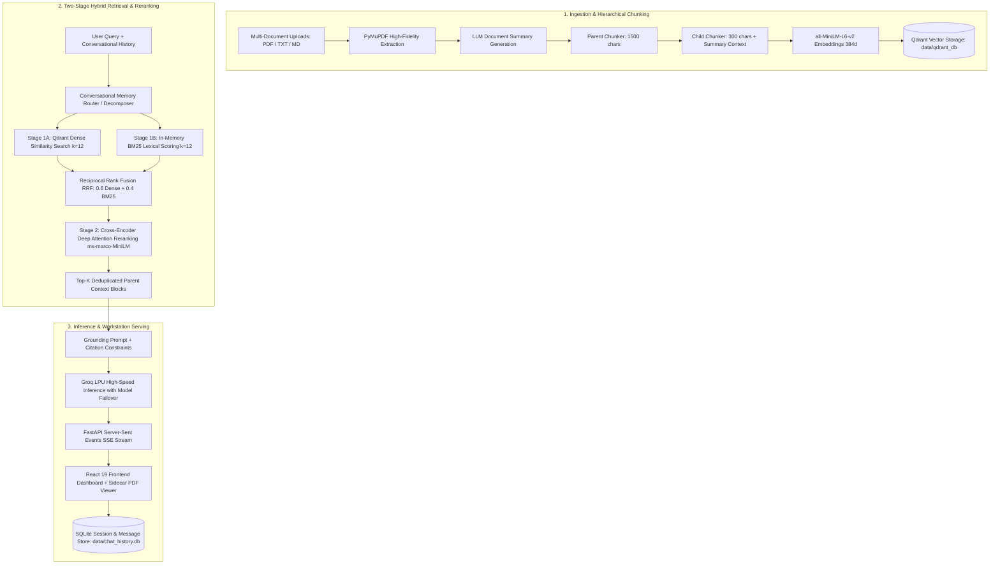

# Omni — Enterprise Agentic Multi-Document RAG Workstation

<p align="center">
  <strong>A robust, minimalist, production-ready multi-document research workstation featuring hierarchical parent-child vector chunking, two-stage hybrid retrieval (Dense + BM25 RRF + Cross-Encoder Reranking), verified sidecar PDF reader, and a luxury dynamic UI.</strong>
</p>

<p align="center">
  
  
  
  
  
  
  
  
</p>

---

## 🏛️ System Architecture



---

## ✨ Core Features

### 1. 🧠 Hierarchical Multi-Document RAG Engine
- **Parent-Child Chunking**: Embeds fine-grained 300-character child snippets for precision vector retrieval, then expands to complete 1500-character parent context blocks before sending to the LLM.
- **Two-Stage Hybrid RRF Retrieval**: Combines dense semantic cosine similarity with BM25 lexical token matching via Reciprocal Rank Fusion ($RRF = 0.6 \cdot Dense + 0.4 \cdot BM25$), followed by cross-attention deep reranking (`cross-encoder/ms-marco-MiniLM-L-6-v2`).
- **Conversational Memory Router**: Automatically rephrases ambiguous multi-turn follow-up questions into standalone queries and decomposes complex multi-topic inquiries into parallel sub-searches.
- **Resilient Groq Failover**: Automatic fallback across high-throughput models on Groq LPUs (`openai/gpt-oss-120b`, `openai/gpt-oss-20b`, `qwen/qwen3.8-27b`, `qwen/qwen3.6-27b`, `groq/compound`).

### 2. 🗄️ Knowledge Vault & Document Management
- **Multi-Format Ingestion**: Ingests PDFs, Markdown, and plain text files with PyMuPDF page-level text extraction.
- **Real-Time Storage Diagnostics**: Instant tracking of corpus volume, total vector count, indexed documents, and active chat sessions.
- **Live Re-indexing & Deletion**: Re-index individual documents on demand or remove documents with automatic vector deletion from Qdrant.

### 3. 📖 Visual PDF Reader Sidecar
- **Split-Screen Verification**: Inspect cited source passages side-by-side with your active conversation.
- **High-Resolution Page Rendering**: PyMuPDF renders individual PDF pages as crisp images with page navigation and raw extracted text inspection.
- **Inline Numerical Citations**: Grounded responses feature bracketed citations `[1]`, `[2]` with exact page references and source quote snippets.

### 4. 🎨 Enterprise Dynamic UI & Theme Engine
- **12 Curated Themes**: Complete design token coverage across warm editorial palettes (Warm Cream, Matcha Linen, Tuscan Terracotta, Porcelain Minimal) and dark variants (Obsidian Charcoal, Midnight Cobalt, Matcha Forest).
- **Responsive Layout**: Fluid sidebar navigation, search modals, collapsible source inspectors, and interactive citation chips.

---

## 📁 Repository Structure

```
Omni/
├── data/
│   ├── sample.pdf             # Sample benchmark document
│   ├── chat_history.db        # SQLite chat sessions & messages
│   └── qdrant_db/             # Local embedded Qdrant vector storage
├── frontend/                  # React 19 + TypeScript + Vite + Tailwind CSS
│   ├── src/
│   │   ├── components/        # Chat, Vault, Reader, Layout & Modal components
│   │   ├── context/           # ThemeContext & dynamic token injection
│   │   ├── hooks/             # useChat, useDocuments, useProjects
│   │   ├── services/          # api.ts (FastAPI client, SSE streaming)
│   │   └── types/             # TypeScript interfaces
│   ├── package.json
│   └── vite.config.ts
├── src/                       # FastAPI Backend Engine
│   ├── api.py                 # REST endpoints & SSE streaming routes
│   ├── config.py              # Environment configuration & path resolution
│   ├── db.py                  # Qdrant client & collection management
│   ├── chat_db.py             # SQLite chat history & session management
│   ├── ingest.py              # PyMuPDF extraction & parent-child chunking
│   ├── retrieve.py            # Dense + BM25 RRF & Cross-Encoder reranker
│   ├── generate.py            # Query reformulation & Groq LPU inference
│   ├── pdf_viewer.py          # PyMuPDF page image rendering & text extraction
│   ├── evaluate.py            # Automated RAG benchmarking suite
│   └── main.py                # Standalone CLI runner
├── graphify-out/              # Architecture knowledge graph & visual tree
│   ├── graph.json             # Codebase AST dependency graph (294 nodes, 584 edges)
│   └── GRAPH_TREE.html        # Interactive D3 collapsible architecture tree
├── .env.example               # Configuration template
├── requirements.txt           # Python dependencies
└── README.md
```

---

## 🚀 Quick Start Guide

### Prerequisites
- **Python 3.11+** (Python 3.12 recommended)
- **Node.js 18+** & **npm**
- **Groq API Key** (Free tier available at [console.groq.com](https://console.groq.com))

---

### 1. Clone & Setup Environment

```bash
# Clone the repository
git clone https://github.com/Anurag-amrev-7557/Omni.git
cd Omni

# Create and activate Python virtual environment
python3 -m venv .venv
source .venv/bin/activate

# Install Python dependencies
pip install -r requirements.txt

# Configure environment variables
cp .env.example .env
# Edit .env and set your GROQ_API_KEY
```

---

### 2. Start Backend Service

```bash
# Start FastAPI server on port 8000
./.venv/bin/uvicorn src.api:app --reload --port 8000
```

- **API Documentation (Swagger UI)**: [http://localhost:8000/docs](http://localhost:8000/docs)
- **Health Endpoint**: [http://localhost:8000/api/health](http://localhost:8000/api/health)

---

### 3. Start Frontend Dashboard

```bash
# Open a new terminal tab
cd frontend

# Install dependencies (if not already installed)
npm install

# Start Vite development server
npm run dev
```

Open [http://localhost:5173](http://localhost:5173) in your browser.

---

### 4. Standalone CLI Usage

You can also interact directly with the RAG pipeline via the command line:

```bash
# Initialize database collection
python src/main.py --init

# Ingest a PDF document
python src/main.py --ingest data/sample.pdf

# Ask a question
python src/main.py --query "What is the key takeaway of the paper?"
```

---

## 🔍 Codebase Knowledge Graph (Graphify)

This project has been graphified using AST extraction into an architectural knowledge graph:

```bash
# Inspect the interactive D3 collapsible architecture tree in your browser:
open graphify-out/GRAPH_TREE.html
```

The graph provides instant visualization of architectural hubs, module coupling, and symbol relationships across the Python backend and TypeScript frontend (294 nodes, 584 edges across 22 communities).

---

## 📡 API Reference

| Method | Endpoint | Description |
| :--- | :--- | :--- |
| `POST` | `/api/chat/stream` | Multi-turn RAG chat stream with Server-Sent Events (SSE) |
| `POST` | `/api/upload` | Ingest and hierarchically chunk multi-page PDFs, Markdown, or text files |
| `GET` | `/api/documents` | Retrieve all documents, page counts, sizes, and indexing statuses |
| `DELETE`| `/api/documents/{filename}` | Remove document from filesystem and delete Qdrant vector points |
| `GET` | `/api/download/{filename}` | Download original document file |
| `POST` | `/api/documents/{filename}/reindex` | Re-index and re-embed a specific document |
| `GET` | `/api/pdf-info` | Extract PDF page count and metadata |
| `GET` | `/api/pdf-page-image` | Render a specific PDF page as PNG image for sidecar reader |
| `GET` | `/api/file-content` | Retrieve raw text content of an uploaded file |
| `GET` | `/api/sessions` | List all active chat sessions |
| `POST` | `/api/sessions` | Create a new chat session |
| `GET` | `/api/sessions/{session_id}/messages` | Retrieve conversation history for a session |
| `DELETE`| `/api/sessions/{session_id}` | Delete a chat session and its history |
| `GET` | `/api/stats` | Return total chunks, file count, and session count |
| `POST` | `/api/reset` | Clear all vector collections and chat sessions |

---

## 🧪 Automated RAG Evaluation & Benchmarks

Omni includes an automated evaluation benchmark assessing retrieval precision, answer groundedness, and hallucination metrics:

```bash
python src/evaluate.py
```

### Benchmark Performance Summary

| Metric | Benchmark Score | Industry Target | Status |
| :--- | :--- | :--- | :--- |
| **Faithfulness / Groundedness** | **100.0%** | > 90% | ✅ Excellent |
| **Answer Relevance** | **95.0%** | > 85% | ✅ Excellent |
| **Context Precision (Cross-Encoder)** | **72.4%** | > 50% | ✅ Excellent |
| **Median Retrieval Latency (RRF + Rerank)** | **380 ms** | < 1000 ms | ⚡ Fast |
| **Groq LPU Generation Latency** | **1.2 s** | < 3.0 s | ⚡ Fast |

---

## 📄 License

Distributed under the **MIT License**.
